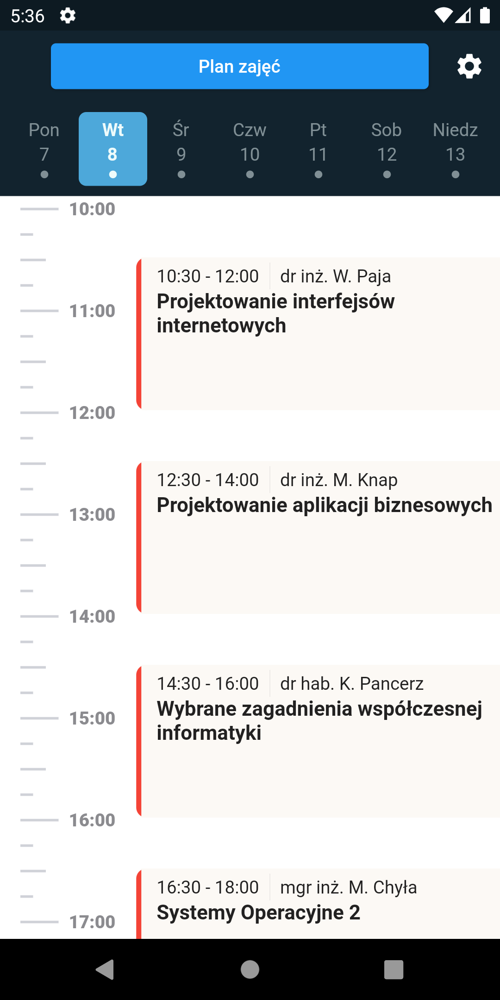
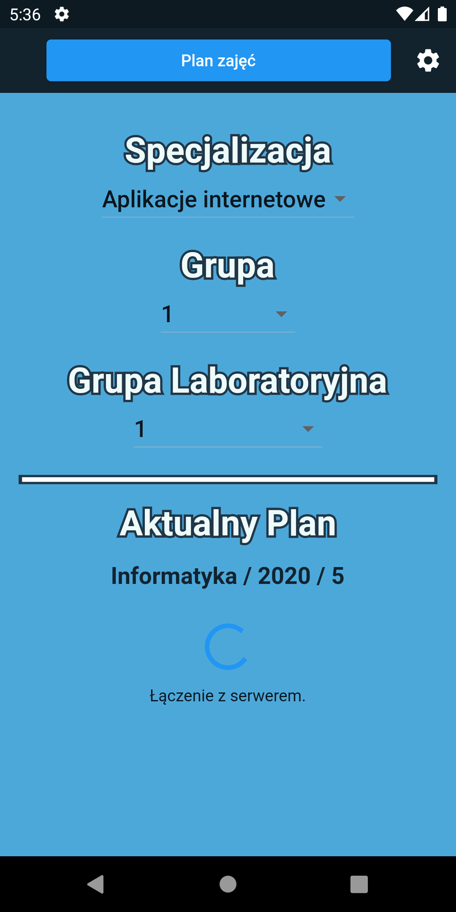
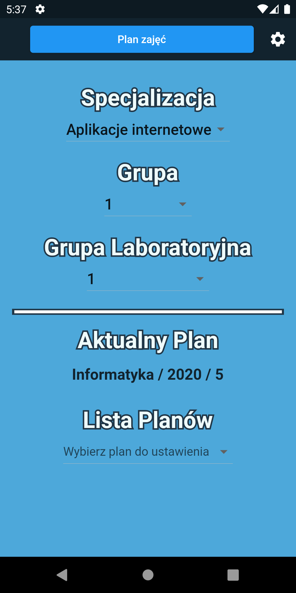

# Project Name: Mobile App with schedule for UR
## Author: Piotr Długosz

## Table of Contents
1. [Technologies]()
1. [Description]()
1. [UI Preview]()
1. [Summary of project]()
1. [Schedule Analysis]()
1. [Data structure]()

## Technologies: 
- Flutter (dart) (for mobile app design)
- Django (python) (as RestAPI for schedule data)

## Description
App will be showing a weekly schedule for UR lecture.  
Data will be downloaded from django as RestApi request returning (json).
## UI Preview

## Summary of project
Project is getting a data from api. Api has 2 endpoints:
1. gather all schedules
1. get details about a chedule by id

Both endpoints are used in settings in DropdownButton (select one) { One is used for a list of values to dropdownbutton, seconde one is used for gathering information from an api about a selected schedule}

Object is stored as String in SharedPreferences preffered way of storing data on client Side by flutter.

Each object have individual jsonMapper from Map.

User that choose a schedule, can got to the schedule section and view a schedule. 

If he wants to he can select a group, laboratories, specializations. If he does not select he will see all lectures.

## Schedule analysis
Schedule is assigned to year of study, field of study and current year, so each one from that is unique.
    
Schedule contains list of days ["monday","tuesday",...]  
Each day contains list of lectures.

Lecture contains information about itself.

Lecture is assigned to week:  
- 1/3 (first and third week of the month)  
- 2/4 (second and fourth week of the month)  
- all (each week of the month)  

Each lecture is assigned to:  
- full year (all students on year)
- main group (all students devided to groups most often 2)
- laboratories group (students from main groups devided to groups)

        Example:
            There are 100 students on year. They are divided to 2 groups, each group is divided to 2 laboratories group.

        - group 1: students from 1 - 50
            - laboratories 1: students from 1 - 25
            - laboratories 2: students from 26 - 50
        - group 2: studnets from 51 - 100
            - laboratories 3: students from 51 - 75
            - laboratories 4: students from 76 - 100

Each student is assigned to one main group, laboratories group and speciality (if division to speciality exists).

## Data structure:
1. Models nested structure
    - [schedule (object Schedule)](https://github.com/piotranon/schedule/blob/80c955d9dc40df443d130b61c6de12e05ede1dde/lib/models/schedule.dart#L9)
        - [weekDay (List \<object WeekDay>)](https://github.com/piotranon/schedule/blob/80c955d9dc40df443d130b61c6de12e05ede1dde/lib/models/weekDay.dart#L3)
            - [lectures (List \<object Lecture>)](https://github.com/piotranon/schedule/blob/80c955d9dc40df443d130b61c6de12e05ede1dde/lib/models/lecture.dart#L4)
                - weeks (String)
                - name (String)
                - start_time (TimeOfDay)
                - end_time (TimeOfDay)
                - group (int)
                - laboratories (int)
                - specialization (int)
                - [lecturer (object Lecturer)](https://github.com/piotranon/schedule/blob/80c955d9dc40df443d130b61c6de12e05ede1dde/lib/models/lecturer.dart#L1)
                    - name (string)
                    - surname (string)
                    - email (string)
                    - academic_title (string)
        - week1_3 (List \<DateTime>)
        - week2_4 (List \<DateTime>)
        - [field (object FieldOfStudy)](https://github.com/piotranon/schedule/blob/80c955d9dc40df443d130b61c6de12e05ede1dde/lib/models/fieldOfStudy.dart#L3)
            - id (id)
            - name (String)
            - semester (int)
            - year (String)
            - groups (List \<int>)
            - laboratories (List \<int>)
            - [specializations (List \<object Specialization>)](https://github.com/piotranon/schedule/blob/80c955d9dc40df443d130b61c6de12e05ede1dde/lib/models/specialization.dart#L1)
                - id (int)
                - name (String)
                - short (String)

1. Individual models with short description
    - [Schedule](https://github.com/piotranon/schedule/blob/80c955d9dc40df443d130b61c6de12e05ede1dde/lib/models/schedule.dart#L9)
        > General object of schedule containing all other objects.
        - Variables
            - field
                > Information about a field of study that is assigned to schedule (Basic point of view, schedule is assigned to field not field to schedule)
            - weekDay
                > Contains all information about a lectures in each day from Monday to Sunday.
            - week1_3
                > Contains list of days which start not even week 
            - week2_4
                > Contains list of days which start even week
        
    - [weekDay](https://github.com/piotranon/schedule/blob/80c955d9dc40df443d130b61c6de12e05ede1dde/lib/models/weekDay.dart#L3)
        > Contains all information about a schedule that means lectures assigned to days.
        - Variables
            - lectures
                > List of Lectures
    
    - [Lecture](https://github.com/piotranon/schedule/blob/80c955d9dc40df443d130b61c6de12e05ede1dde/lib/models/lecture.dart#L4)
        > Contains information about a lecture
        - Variables
            - weeks
                > Information about if lecture is even/not even or both weeks.
            - name 
                > name of the lecture
            - start_time
                > time when lecture start
            - end_time
                > time when lecture end
            - group
                > group assigned to lecture (if group not specified all assigned)
            - laboratories
                > laboratories group assigned to lecture (if laboratories not specified all assigned)
            - specialization
                > specializations group assigned to lecture (if specialization not specified all assigned)
            - lecturer
                > basic information about a lecturer of lecture
    
    - [Lecturer](https://github.com/piotranon/schedule/blob/80c955d9dc40df443d130b61c6de12e05ede1dde/lib/models/lecturer.dart#L1)
        > Contains information about a lecturer
        - Variables
            - name
                > name of lecturer
            - surname
                > surname of lecturer
            - email
                > email of lecturer for contact
            - academic_title
                > academic title of lectuter
    
    - [FieldOfStudy](https://github.com/piotranon/schedule/blob/80c955d9dc40df443d130b61c6de12e05ede1dde/lib/models/fieldOfStudy.dart#L3)
        > Contains information about a field of study
        - Variables
            - id
            - name
                > name of field
            - semester
                > semester study
            - year
                > year of schedule
            - specializattions
                > List of specialization on the year with details
            - groups
                > List of int with all groups on the year
            - laboratories
                > List of int with all laboratories group on the year
    
    - [Specialization](https://github.com/piotranon/schedule/blob/80c955d9dc40df443d130b61c6de12e05ede1dde/lib/models/specialization.dart#L1)
        > Contains information about a specialization
        - Variables
            - id
            - name
                > name of specialization
            - short
                > short name of specialization almost always first letters of names
